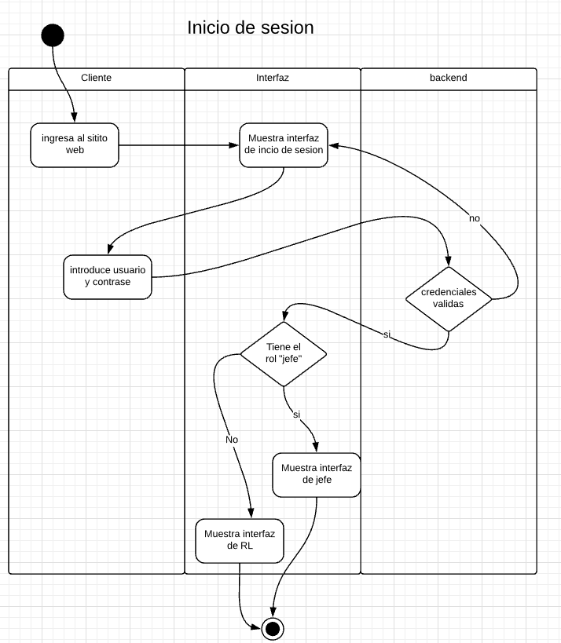
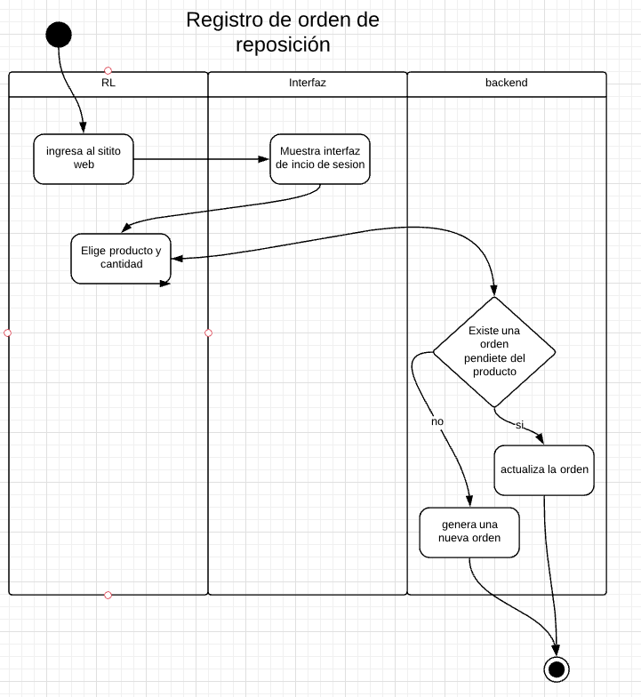
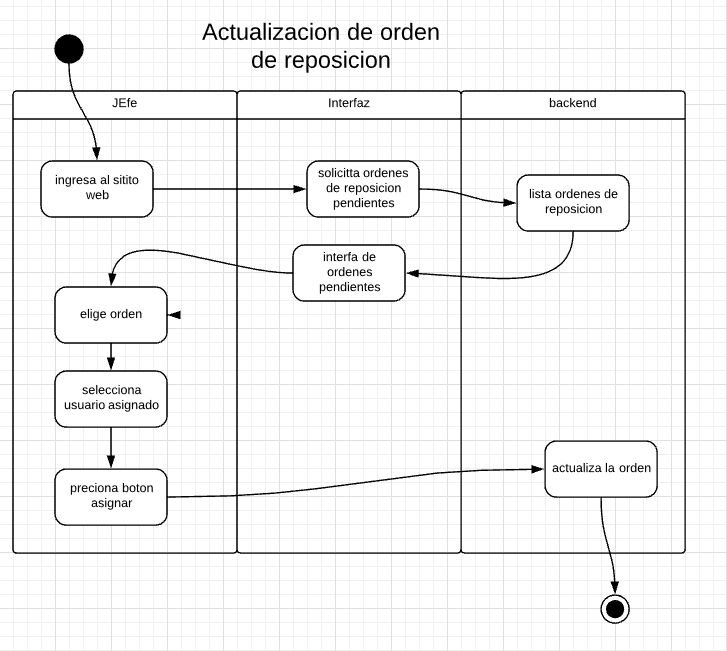
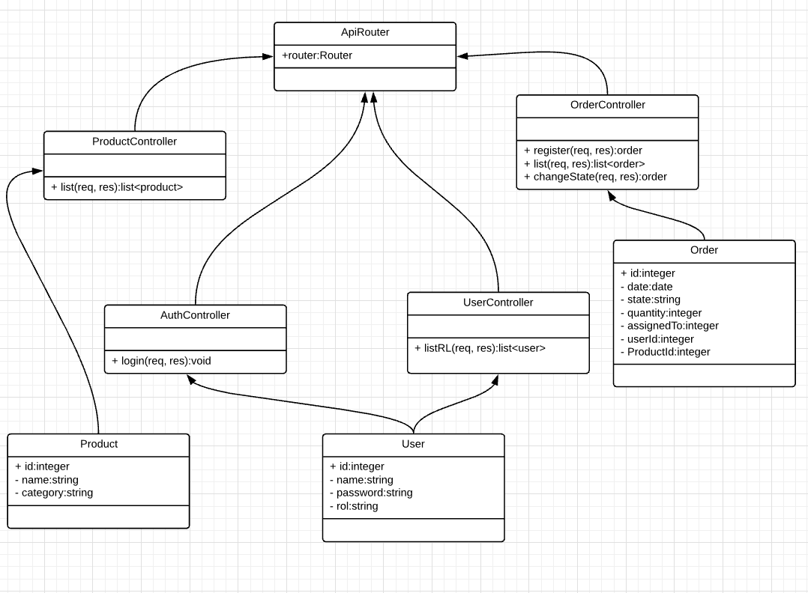

# Prueba para Tottus

## Servidor

para ejecutar: 

- cd backend-tottus
- npm install
- npm start

para setear data de prueba: npm run init-data

## Cliente

para ejecutar: 

- cd client-tottus
- npm install
- npm start

## ususarios de prueba 

RL: 

spidy@avenger.org: 1234

thehulk@avenger.org: 1234

Jefes: 
imironman@avenger.org: 1234

## Documentación

### Diagramas de actividades

### Diagrama de clases

### Open Api Specificatron

[JSON](doc/swaggerBackend,json)

[PDF](doc/swagger.pdf)